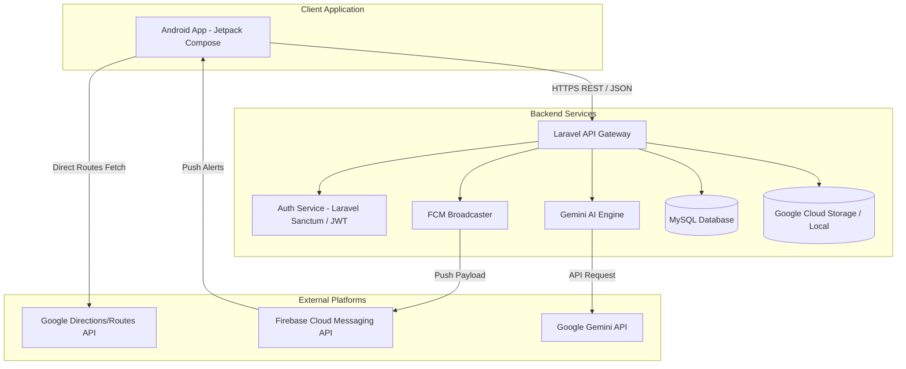

# 01 - System Architecture & Modules Overview

This document outlines the high-level backend architecture for the **NagarRakshak** Community Safety & Hazard Alert Platform. The backend is designed as a secure, stateless RESTful API utilizing **Laravel 12**, **MySQL 8.0+**, **Google Gemini 1.5 Flash**, and **Firebase Cloud Messaging (FCM)**.

---

## 1. System Architecture Diagram



---

## 2. Core Functional Modules

The backend consists of the following tightly integrated modules:

1. **Authentication**: Manages citizen registration, login, token issue/refresh, and Google account integration. Uses JWT with access and refresh tokens.
2. **Users**: Manages user profiles, role assignments (Citizen, Volunteer, Department, Admin), contributions tracking, reputation points, and leaderboard placements.
3. **Hazards**: Core CRUD layer for community hazards (Potholes, Open Drains, etc.), coordinates tracking, and photo attachments.
4. **AI Reporting**: Integrates Gemini 1.5 Flash to automatically detect issue categories, suggest severity levels, generate descriptions, and draft municipal petition letters.
5. **Maps**: Handles spatial indexing for maps queries, bounding-box searches, nearby hazard discovery, and marker clusters.
6. **Safe Navigation**: Computes safest routes by cross-referencing hazards against route polylines, calculating Risk Scores, and generating warning sequences.
7. **Notifications**: Manages FCM push registration, target filters (by radius, category, or role), and emergency broadcast alerts.
8. **Reports**: Compiles compliance and summary exports (PDF/CSV) for municipality departments.
9. **Comments**: Provides community discussions and evidence threads on reported hazards.
10. **Bookmarks**: Allows users to save specific hazards or safety zones to receive direct alerts about them.
11. **Likes**: Supports reputation scores by allowing citizens to upvote/verify reported issues.
12. **Emergency**: Dedicated endpoint for real-time SOS broadcasts, sharing live locations, and notifying emergency contacts.
13. **Departments**: Multi-department support (Municipal Corporation, Traffic Police, Electricity Board) for ticket assignment and resolving issues.
14. **Settings**: Handles global system parameters, severity weights, and user preferences synchronization.

---

## 3. Communication Protocol (Android ⇄ Backend)

All client-backend communications occur over **HTTPS** using standard **REST** patterns. 

* **Serialization**: All request and response bodies are formatted in standard UTF-8 **JSON**.
* **Authentication Header**: Protected routes require the standard Bearer Token scheme:
  ```http
  Authorization: Bearer <Access_Token>
  ```
* **Statelessness**: The backend does not maintain sessions. Each request must carry all authentication credentials and state context.
* **Multipart Requests**: File uploads (hazard photos) use `multipart/form-data` encoding, wrapping the metadata in JSON fields.
