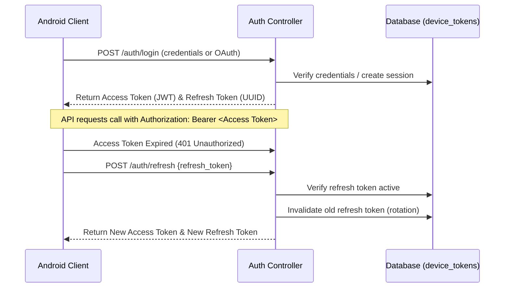

# 05 - Authentication & Role Permissions

NagarRakshak uses stateless **JSON Web Token (JWT)** authentication. Access is verified using signature verification on the API servers without database hits, while Refresh Tokens are checked against database logs to enable secure token rotation.

---

## 1. Token Mechanism & Lifecycle

* **Access Token**: Short-lived JWT (15-minute expiration) signed via HS256/RS256. Contains user scopes, claims, role, and ID.
* **Refresh Token**: Long-lived UUIDv4 string (30-day expiration) stored securely on the backend in the database and rotation-checked.
* **Token Rotation**: Every refresh request revokes the previous refresh token and yields a new one to prevent reuse attacks.

---

## 2. Roles & Access Matrix

We support four standard application roles:

1. **Citizen**: Standard reporter account. Can submit hazards, vote/verify, write comments, view leaderboards, and update profiles.
2. **Volunteer**: Trusted reporter account. All votes count double in verification rankings.
3. **Department**: Municipal officer account. Assigned to resolve hazards. Can post official timeline logs and update hazard status.
4. **Admin**: Platform manager. Full read/write/delete scope, controls prompt configurations, suspends accounts, and manages systems.

---

## 3. Permissions Matrix

| Permission Name | Citizen | Volunteer | Department | Admin |
| :--- | :---: | :---: | :---: | :---: |
| `hazards.report` | Yes | Yes | No | Yes |
| `hazards.verify` | Yes | Yes | No | Yes |
| `hazards.update` (Own) | Yes | Yes | No | Yes |
| `hazards.update` (All) | No | No | Yes | Yes |
| `hazards.delete` | No | No | No | Yes |
| `comments.write` | Yes | Yes | Yes | Yes |
| `comments.delete` (All)| No | No | No | Yes |
| `timeline.post` | No | No | Yes | Yes |
| `settings.update` | No | No | No | Yes |
| `users.suspend` | No | No | No | Yes |
