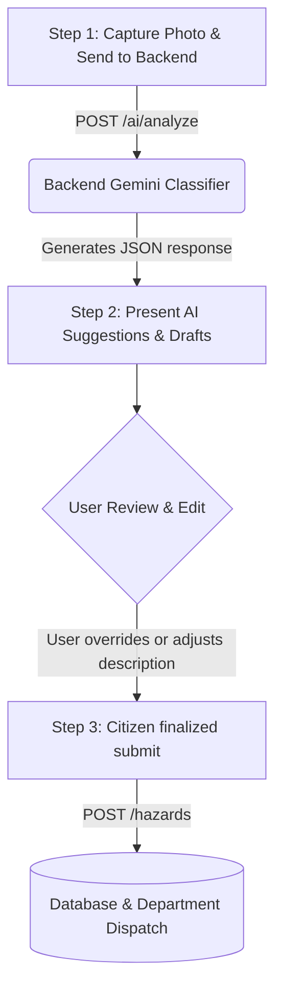

# 06 - AI Reporting Workflow

This document details the step-by-step reporting lifecycle. The Android application leverages backend-assisted **Gemini 1.5 Flash** visual analysis to classify hazards, suggest risk levels, and compile municipal petitions.

---

## 1. Flow Diagram



---

## 2. Step 1: Analyze Endpoint Payload
* **Endpoint**: `POST /api/v1/ai/analyze`
* **Content-Type**: `multipart/form-data`
* **Request Fields**:
  * `image`: File (JPEG/PNG, Max 10MB)
  * `latitude`: Decimal (e.g., `25.18200000`)
  * `longitude`: Decimal (e.g., `75.82800000`)

---

## 3. Step 2: Backend AI Prompt & Output Response
The backend receives the photo, uploads it securely to storage, and queries the **Gemini 1.5 Flash API** using a structured system prompt:

> **System Prompt Example**:
> *"Analyze this municipal hazard photo. Classify the hazard category into one of: Pothole, Open Drain, Open Manhole, Waterlogging, Broken Streetlight, Garbage. Suggest severity (low, medium, high, critical). Provide a 2-sentence description. Generate a formal petition letter addressed to the Municipal Commissioner, Kota, starting with 'To,\nThe Municipal Commissioner...' demanding resolution."*

### AI Response JSON returned to Android App (Status 200 OK)
```json
{
  "success": true,
  "data": {
    "ai_analysis_id": 402,
    "predicted_category": "Open Drain",
    "predicted_severity": "High",
    "confidence_score": 94.50,
    "generated_summary": "A large open drain is exposed on the corner of the sidewalk, creating a severe fall risk for pedestrians.",
    "petition_draft": "To,\nThe Municipal Commissioner,\nKota Municipal Corporation,\nKota, Rajasthan.\n\nSubject: Request to cover the open drain on Mahaveer Road.\n\nSir/Madam,\n\nI am writing to draw your attention to a critical safety concern on Mahaveer Road. An open drain at coordinates 25.2100, 75.8600 poses an immediate danger to community safety. We request your department to inspect and cover this drain immediately to prevent accidents.\n\nSincerely,\nA Concerned Citizen"
  }
}
```

---

## 4. Step 3: Finalized Submission Payload
The user reviews the generated letter and summary, adjusts the category or text if necessary, and submits. The client sends the finalized data to the backend.

* **Endpoint**: `POST /api/v1/hazards`
* **Content-Type**: `application/json`
* **Request JSON Payload**:
  ```json
  {
    "title": "Open Drain on Mahaveer Road corner",
    "description": "Large open drain on Mahaveer Road corner posing safety risk to commuters.",
    "category_id": 3,
    "latitude": 25.21000000,
    "longitude": 75.86000000,
    "address": "Mahaveer Nagar, Kota",
    "ai_analysis_id": 402
  }
  ```

* **Success Response (201 Created)**: Returns the Standard DTO schema as specified in `04-request-response-models.md`, logging the hazard officially.
