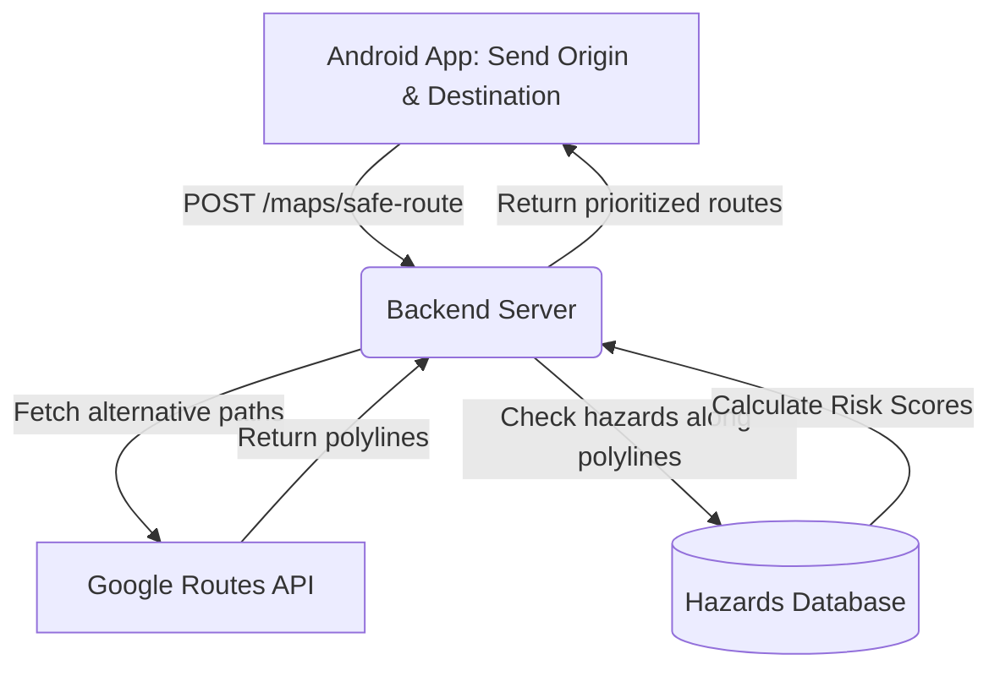

# 08 - Safe Ride Navigation

This document explains the safe navigation lifecycle. It outlines how the system calculates route hazard density risk scores, logs ride telemetry data, and warns riders of upcoming hazards.

---

## 1. Route Query & Risk Score Calculations



### Risk Score Formula
For each route polyline returned by the Google Routes API, the backend calculates a **Risk Score** based on nearby hazards (within 100m of any polyline segment):
$$\text{Risk Score} = \sum (\text{Critical} \times 5) + (\text{High} \times 3) + (\text{Medium} \times 2) + (\text{Low} \times 1)$$

### Route Selection Priority
1. **Primary**: Safest Route (lowest Risk Score).
2. **Secondary**: Fastest Route (lowest duration in seconds).
3. **Third**: Shortest Route (lowest distance in meters).

---

## 2. Navigation Session State Machine

A ride navigation session is tracked using three distinct states:

```
[ POST /ride/start ] ──> ( State: ACTIVE ) ──> [ POST /ride/share-location ]
                               │
                               ▼
                        [ POST /ride/end ] ──> ( State: COMPLETED )
```

1. **Start Session (`POST /api/v1/ride/start`)**:
   * Registers a unique `session_id`.
   * Stores the planned route polyline, origin/destination details, and initial risk score metrics.
2. **Telemetry Pings (`POST /api/v1/ride/share-location`)**:
   * Triggers every 15-30 seconds from the Android client.
   * Send coordinate, timestamp, speed, and heading parameters.
   * Allows live map family sharing.
3. **End Session (`POST /api/v1/ride/end`)**:
   * Transitions session to `completed`.
   * Logs duration, final distance, and any incidents encountered during the trip.

---

## 3. Live Proximity Alerts & Voice Prompts
* **Alert Buffer Zone**: The Android application monitors the rider's active location. If the current coordinate is within **100 meters** of an active database hazard, the app displays the flashing warning card overlay.
* **Voice Alerts (TTS)**: The application triggers a Text-to-Speech voice alert (e.g. *"Warning: Pothole 80 meters ahead. Slow down."*) to ensure safety while riding.
* **Pre-fetching Alerts**: When starting a session, the client pre-fetches all hazard markers along the route coordinates using:
  `GET /api/v1/maps/live-alerts?session_id=<id>`
  This minimizes API overhead while navigation is active.
